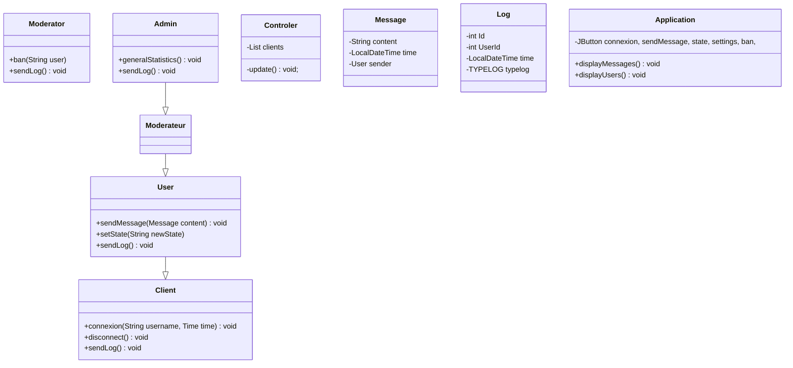

```mermaid
    classDiagram
    class Client {
        +connexion(String username, Time time) void
        +disconnect() void
        +sendLog() void
    }
    class User {
        +sendMessage(Message content) void
        +setState(String newState)
        +sendLog() void
    }
    class Moderator {
        +ban(String user)
        +sendLog() void
    }
    class Admin {
        +generalStatistics() void
        +sendLog() void
    }
    User --|> Client
    Admin --|> Moderateur
    Moderateur --|> User
    
    class Controler {
        -List<Client> clients
        -update() void;
    }
    
    class Message {
        -String content
        -LocalDateTime time
        -User sender
    }
    class Log {
        -int Id
        -int UserId
        -LocalDateTime time
        -TYPELOG typelog 
    }
    
    class Application {
        -JButton connexion, sendMessage, state, settings, ban, 
        +displayMessages() void
        +displayUsers() void
        
    }
```