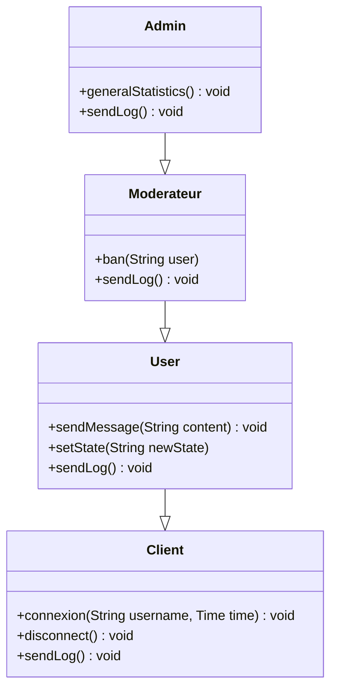

```mermaid
    classDiagram
    class Client {
        +connexion(String username, Time time) void
        +disconnect() void
        +sendLog() void
    }
    class User {
        +sendMessage(String content) void
        +setState(String newState)
        +sendLog() void
    }
    class Moderateur {
        +ban(String user)
        +sendLog() void
    }
    class Admin {
        +generalStatistics() void
        +sendLog() void
    }
    Admin --|> Moderateur
    Moderateur --|> User
    User --|> Client
```